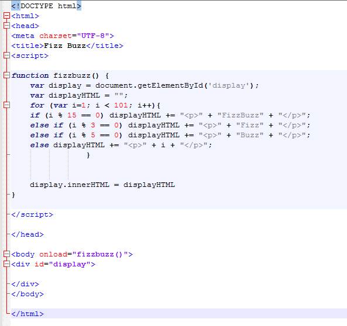

# My Faith in Christ
As I have made this project about key areas of my life I would be foolish not to include a whole section to about my faith in Jesus Christ. If you misclicked this page click [_**here**_](/README.md) to go back to the home page. 
## The Start
  I was brought up in a Christian home. We went to Church most Sundays and did what is typical of most Christian families: 
  * Prayed before Dinner
  * Non-sunday Church
  * Awanas 
  * Read the Bible (usually just on Sunday for me)
  
We were generaly involved in the Church. Due to this being my habitus I eventually came to accept Jesus Christ as my Lord and Saviour when I was 12. I was baptized on July 11th or 10th I would like to say. A baptism is to represent outwardly a change in direction of one's life. A change from living for yourself to instead dying to your own desires and live for Christ our King. I do not think I understood that at 12 years old. Idid what I wanted and was essentaially stagnant in my fiath until I reached College.
  
## College 
  I joined Veritas which is one of the Christian Organizations here on campus. My cousin ran sound for Veritas and with that connection I had and in to the music team (as I was looking to play bass or guitar). I eventually joined both the music team and a small group. While I was serving and learning on certain days of the week, that wisdom did not transfer to all the other days. I did not go to Church (having been turned off beacuse I went on the day they asked for money), my current relationship with my then girlfriend did not include God at all. Essentially I was living two lives. One of excess and one of disguising it. I hit my nadir near the end of first semester. I had just broken up with my then girlfriend because God would no longer allow me have such cognative dissonance. I then struggled with alcohol and lust using them as a coping mechanism for the shame existing from last semester. But luckily God was with me and started to change me through the people around me. My small group leaders challeneged me in my faith. I started to read the Bible because I wanted to know what I actually believe. I recently finished my first read through. I started to go to Church, I became aware of how I was treating people and more aware of the ways in which I was not living for Christ's Kingdom. Am I perfect? No. I still mess up and commit sins that I thought I had a hold of (that is the hubris of man). My journey with Christ is not one that exists in one read through of His Word but it is an eternal walk of Faith and submission to His Will. I am not perfect, I am a sinner, and that is why I need Jesus. Who else is there? 
  
  ## Veritas Music Team
Like I said above, I am on the music team and it is the best thing ever. It has been what has gotten me through this semsester. It is the best part of my week getting to worship God through music with others. We started to record our services and our YouTube page is linked [_**here**_](https://www.youtube.com/c/VeritasCOMO/videos). These people are my family and I am blessed to be with them. 
Here is there [website](https://www.veritasmizzou.com/the-campus).
    
    
 #### Because you asked...
  Here is a block of code from my fizzBuzz challenege: 
  
  
  
  #### Links to other pages
* [Home](/README.md)
* [Music](/Music.md)
* [Supertramp](/Supertramp.md)
* [Faith](/Faith.md)
* [Politics](/Politics.md)
  
