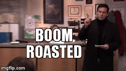

# Politics
  Maybe not the most fun topic for some people, but to me it is sports with actual consequences.
  If you misclicked this page click [**here**](/README.md) to go back.
  
## Origin of Liking
  My family always had the news on once we got cable and before that local news. So growing up I guess I just had an intrest in current events and the news. General elections were always the coolest because it was essentially the SuperBowl. I barely remember 2008 and do not at all remember 2004 except for some fun political videos linked [here](https://www.youtube.com/watch?v=z8Q-sRdV7SY) and [here](https://www.youtube.com/watch?v=hE8V22unwRo). It was fun but also frustrating (not because **_I_** knew what was going on but because of my parents reactions. A second grader does not know why they don't like Hillary Clinton except for that she is _bad_. When they grow up then they find out why they don't like her. 
  ### 2008 Election
  Then Senator Obama was elected to the Presidency over McCain and I remeber I though Biden's name was actually Burden.
  ### 2012 Election
  This is what I call my _sister's election_ this was the one were she was heavily involved in calling for candidates even though she could not vote (it was legal back then). This was **her** election. Too bad she picked a loser. [Here](https://www.270towin.com/2012_Election/) is the electoral map.

## THE 2016 PRESIDENTIAL ELECTION
This was **_my_** moment. This was **_MY_** election! Could I vote? NO. Did I care? NO. It was shaping up to be pretty boring and then some guy decided to talk about a wall and some law and order and really that was about it. Then he won. I called it back in July 2015 (no one cares when I tell them that though). I still cannot believe he won. If I could relive just the poltical parts from June 16th 2015 to January 21 2017 I would. [Here](https://www.270towin.com/maps/2016-actual-electoral-map) is the electoral map.

## 2020 Election
Less enthuasiasm but still engaged in the happenings. Who ever wins I wish them the best, truly!

### Because you asked...
Here is a block of code. 

name = 'Jackson Samson'

print(name)

print("I am majoring in economics and sociology.")

print("I am not that big of fan of breakfast foods.")

print("I love medium rare steaks")

print("Math heavy classes should not be taught through pre-recorded lectures.")

print("The End.")

#### Links to other pages
* [Home](/README.md)
* [Music](/Music.md)
* [Supertramp](/Supertramp.md)
* [Faith](/Faith.md)
* [Politics](/Politics.md)
